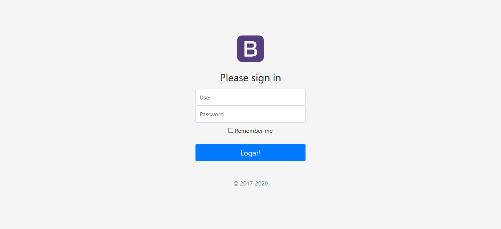

# Login
> Uma página de login Simples!

Página de login feita com PHP, com sistema de cookies, para lembrar login e senha!

## Instalação

### Primeiramente importe o banco de dados que esta no diretório principal.

### Depois abra o arquivo MySql.php na pasta classes e altere essas constantes a seguir:
  
>Aqui você defini as constantes para o banco de dados, se você usa um 
servidor local como xampp você só vai ter que alterar o `DATABASE` e 
colocar nome que você deu ao seu banco de dados
 
    define('HOST','localhost');
    define('USER','root');
    define('PASSWORD','');
    define('DATABASE','nome_do_database');

### Agora você pode abrir o site no seu navegador

### Para acessar use: login:`admin`, password:`admin`

## Meta

Jonas Pires da Silva – jp.progdev@gmail.com
